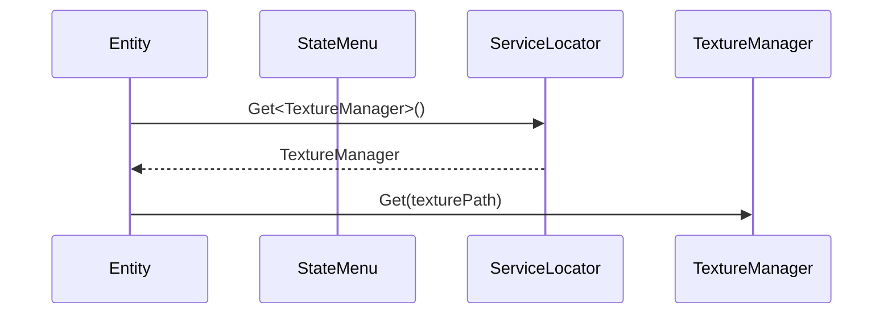
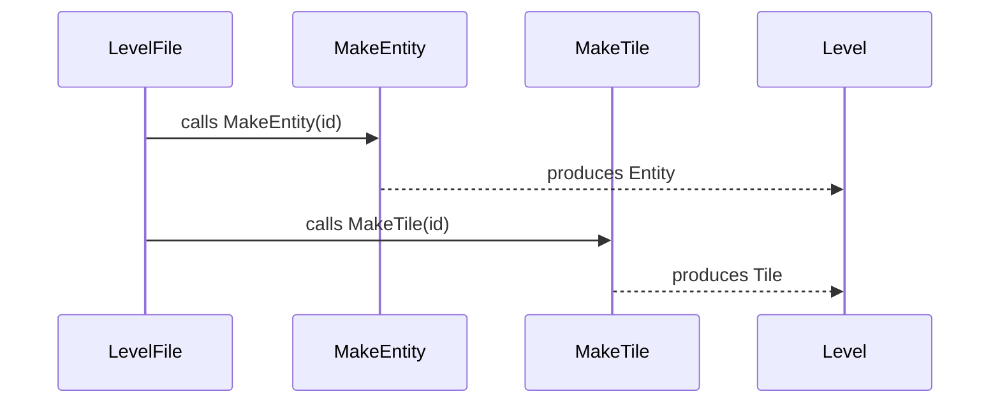
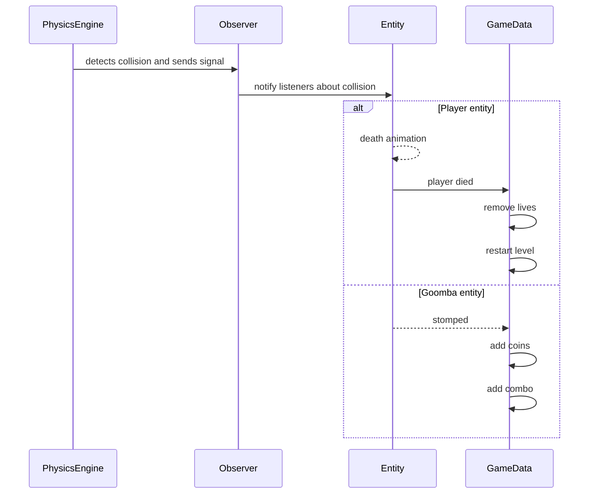
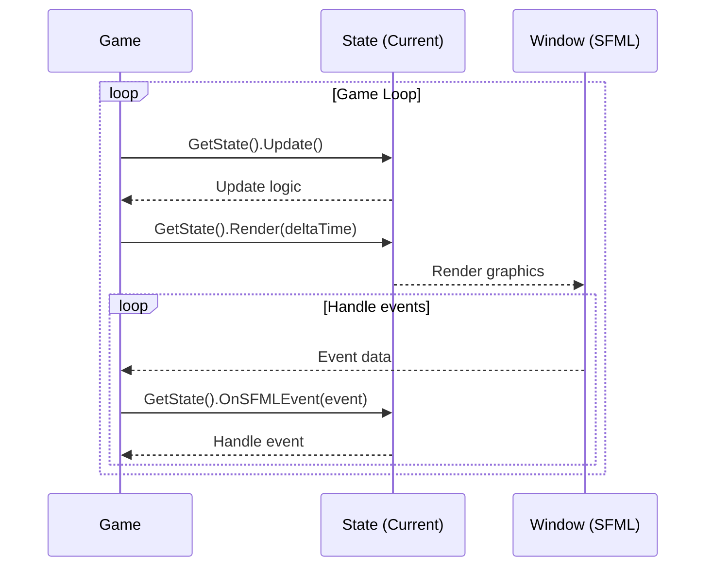

## Game loop

Update entities (velocity, animation, ...) -> Physics engine -> Render

Physics engine: Move entities -> Check collision -> Resolve (push colliders away and signal to observer)

# Design patterns

## Service Locator & Flyweight pattern

Since the texture manager "shares" texture data between different instances of Goomba, etc... this is also an instance of the Flyweight pattern.

## Factory pattern

## Observer pattern

## State pattern

